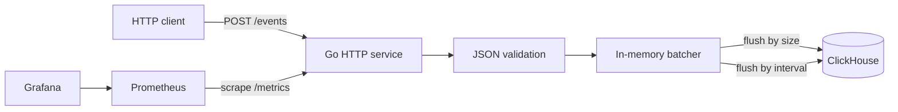

# clickpulse — ClickHouse event collector with batching and observability


Read this in other languages: [Russian](README.ru.md)

`clickpulse` is a small Go service for collecting analytical events over HTTP, buffering them in memory, and writing them to ClickHouse in batches.

It is built as a practical backend/observability project: HTTP ingestion, validation, size/time based batching, ClickHouse storage, Prometheus metrics, Grafana dashboard, Docker Compose setup, and basic Kubernetes manifests.

Use it when you want to:

- accept events through a simple HTTP API
- reduce ClickHouse insert pressure by writing events in batches
- flush events either by batch size or by time interval
- expose service metrics for Prometheus and Grafana
- run the whole stack locally with Docker Compose

## Contents

- [How It Works](#how-it-works)
- [Quick Start](#quick-start)
- [API](#api)
  - [POST /events](#post-events)
  - [GET /healthz](#get-healthz)
  - [GET /metrics](#get-metrics)
- [Configuration](#configuration)
- [Observability](#observability)
- [Docker Compose](#docker-compose)
- [Kubernetes](#kubernetes)
- [Development](#development)
- [License](#license)

## How It Works



The service receives events through `POST /events`, validates the JSON payload, and puts accepted events into an in-memory batcher.

The batcher flushes events to ClickHouse when one of these conditions is met:

- the batch reaches `BATCH_SIZE`
- `FLUSH_INTERVAL` passes since the previous flush

This keeps the API simple while avoiding row-by-row inserts into ClickHouse.

## Quick Start

Clone the repository and run the local stack:

```bash
git clone https://github.com/timur-developer/clickpulse.git
cd clickpulse
docker compose up --build -d
```

After startup, the services are available at:

| Service | URL |
| --- | --- |
| clickpulse | `http://localhost:8080` |
| ClickHouse HTTP | `http://localhost:8123` |
| Prometheus | `http://localhost:9090` |
| Grafana | `http://localhost:3000` |

Send a test event:

```bash
curl -X POST http://localhost:8080/events \
  -H "Content-Type: application/json" \
  -d '{
    "event_type": "page_view",
    "source": "landing",
    "user_id": "u123",
    "value": 1,
    "created_at": "2026-03-27T12:00:00Z"
  }'
```

Check the service health:

```bash
curl http://localhost:8080/healthz
```

Check Prometheus metrics:

```bash
curl http://localhost:8080/metrics
```

## API

### `POST /events`

Accepts a single analytical event in JSON format.

Example request:

```json
{
  "event_type": "page_view",
  "source": "landing",
  "user_id": "u123",
  "value": 1,
  "created_at": "2026-03-27T12:00:00Z"
}
```

Fields:

| Field | Type | Required | Description |
| --- | --- | --- | --- |
| `event_type` | string | yes | Event name, for example `page_view`, `signup`, `click` |
| `source` | string | yes | Event source, for example `landing`, `api`, `mobile` |
| `user_id` | string | no  | User or client identifier |
| `value` | number | no  | Numeric event value |
| `created_at` | string | yes | Event timestamp in RFC3339 format |

Successful response:

```json
{"status":"accepted"}
```

Invalid payloads return `400 Bad Request` with an error message.

### `GET /healthz`

Health check endpoint.

```bash
curl http://localhost:8080/healthz
```

Example response:

```json
{"status":"ok"}
```

### `GET /metrics`

Prometheus scraping endpoint.

```bash
curl http://localhost:8080/metrics
```

The endpoint exposes technical metrics for HTTP traffic, accepted events, batch flushes, and ClickHouse insert errors.

## Configuration

The service is configured through environment variables.

| Variable | Description | Example |
| --- | --- | --- |
| `HTTP_PORT` | HTTP server port | `8080` |
| `CLICKHOUSE_DSN` | ClickHouse connection string | `http://localhost:8123?user=app&password=app` |
| `BATCH_SIZE` | Number of events that triggers a flush | `100` |
| `FLUSH_INTERVAL` | Time interval that triggers a flush | `5s` |
| `LOG_LEVEL` | Application log level | `info` |

Example local configuration:

```bash
export HTTP_PORT=8080
export CLICKHOUSE_DSN="http://localhost:8123?user=app&password=app"
export BATCH_SIZE=100
export FLUSH_INTERVAL=5s
export LOG_LEVEL=info
```

## Observability

`clickpulse` exposes metrics in Prometheus format and includes a Grafana setup for local development.

Useful signals to watch:

- request rate for `POST /events`
- HTTP latency
- number of accepted events
- current batch size
- batch flush count
- ClickHouse insert errors

This makes it easier to answer questions like:

- Is the service receiving events?
- Are requests getting slower?
- Are batches flushing regularly?
- Are ClickHouse inserts failing?
- Does changing `BATCH_SIZE` or `FLUSH_INTERVAL` affect throughput?

## Docker Compose

The Docker Compose setup is intended for local testing and demos.

Typical workflow:

```bash
docker compose up --build -d
docker compose ps
docker compose logs -f clickpulse
```

Stop the stack:

```bash
docker compose down
```

Remove volumes as well:

```bash
docker compose down -v
```

## Kubernetes

Basic Kubernetes manifests are stored in `k8s/`.

Apply them:

```bash
kubectl apply -f k8s/
```

The manifests are intentionally minimal and are meant as a starting point. They expect ClickHouse to be available through `CLICKHOUSE_DSN`.

## Development

Run tests:

```bash
go test ./...
```

Run locally without Docker Compose:

```bash
export HTTP_PORT=8080
export CLICKHOUSE_DSN="http://localhost:8123?user=app&password=app"
export BATCH_SIZE=100
export FLUSH_INTERVAL=5s

go run ./cmd/app
```

Build the service:

```bash
go build ./...
```

## License

MIT. See [LICENSE](LICENSE).
