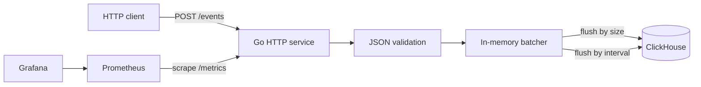

# clickpulse — сервис сбора событий с батчевой записью в ClickHouse


Read this in other languages: [English](README.md)

`clickpulse` — Go-сервис для приёма аналитических событий по HTTP и пакетной записи в ClickHouse.

Он накапливает принятые события в памяти и отправляет их в ClickHouse батчами — по размеру батча или по интервалу времени. Так сервис снижает количество отдельных записей в базу и оставляет API для приёма событий простым.

`clickpulse` также предоставляет observability для пайплайна приёма и записи событий: Prometheus-метрики и Grafana-дашборд помогают отслеживать входящие события, отправку батчей, задержку HTTP-запросов, текущий размер батча и ошибки записи в ClickHouse.

## Содержание

- [Зачем](#зачем)
- [Что делает сервис](#что-делает-сервис)
- [Как устроено](#как-устроено)
- [Быстрый старт](#быстрый-старт)
- [API](#api)
  - [POST /events](#post-events)
  - [GET /healthz](#get-healthz)
  - [GET /metrics](#get-metrics)
- [Конфигурация](#конфигурация)
- [Observability](#observability)
- [Docker Compose](#docker-compose)
- [Kubernetes](#kubernetes)
- [Разработка](#разработка)
- [Лицензия](#лицензия)

## Зачем

Аналитические события часто приходят из backend-сервисов, лендингов, скриптов или внутренних инструментов. Самый простой вариант — сразу записывать каждое событие в ClickHouse отдельно, но при большом потоке это создаёт лишнюю нагрузку на базу и усложняет понимание того, что происходит на пути от HTTP-запроса до записи события.

`clickpulse` закрывает основной сценарий приёма аналитических событий:

- принимает события через простой HTTP API
- проверяет входящий JSON перед принятием события
- собирает принятые события во внутренний батчер в памяти
- отправляет события в ClickHouse по размеру батча или по интервалу времени
- предоставляет observability для HTTP-трафика, принятых событий, состояния батча, отправки батчей и ошибок записи в ClickHouse
- поднимает локальный стек через Docker Compose

## Что делает сервис

| Область | Описание |
| --- | --- |
| HTTP API | Принимает аналитические события через `POST /events` |
| Валидация | Проверяет обязательные поля и формат тела запроса перед принятием события |
| Батчинг | Буферизует события в памяти и отправляет их по размеру батча или по интервалу времени |
| Хранение | Записывает принятые события в ClickHouse |
| Проверка состояния | Отдаёт `GET /healthz` для проверки состояния сервиса |
| Метрики | Отдаёт Prometheus-метрики по HTTP-трафику, батчингу и ошибкам записи в ClickHouse |
| Observability | Включает Grafana-дашборд для мониторинга приёма и записи событий |
| Локальный запуск | Даёт Docker Compose-конфигурацию для clickpulse, ClickHouse, Prometheus и Grafana |
| База для деплоя | Содержит Kubernetes-манифесты в `k8s/` |

## Как устроено



Сервис принимает события через `POST /events`, проверяет тело запроса и кладёт принятые события во внутренний батчер в памяти.

Батчер отправляет события в ClickHouse, когда выполняется одно из условий:

- размер батча достигает `BATCH_SIZE`
- с предыдущей отправки прошло `FLUSH_INTERVAL`

Так API остаётся простым, а ClickHouse не получает отдельную запись на каждое событие.

## Быстрый старт

Склонируйте репозиторий и запустите локальный стек:

```bash
git clone https://github.com/timur-developer/clickpulse.git
cd clickpulse
docker compose up --build -d
```

После запуска сервисы будут доступны по адресам:

| Сервис | URL |
| --- | --- |
| clickpulse | `http://localhost:8080` |
| ClickHouse HTTP | `http://localhost:8123` |
| Prometheus | `http://localhost:9090` |
| Grafana | `http://localhost:3000` |

Отправьте тестовое событие:

```bash
curl -X POST http://localhost:8080/events \
  -H "Content-Type: application/json" \
  -d '{
    "event_type": "page_view",
    "source": "landing",
    "user_id": "u123",
    "value": 1,
    "created_at": "2026-03-27T12:00:00Z"
  }'
```

Проверьте состояние сервиса:

```bash
curl http://localhost:8080/healthz
```

Посмотрите Prometheus-метрики:

```bash
curl http://localhost:8080/metrics
```

## API

### `POST /events`

Принимает одно аналитическое событие в JSON-формате.

Пример запроса:

```json
{
  "event_type": "page_view",
  "source": "landing",
  "user_id": "u123",
  "value": 1,
  "created_at": "2026-03-27T12:00:00Z"
}
```

Поля:

| Поле | Тип | Обязательное | Описание |
| --- | --- | --- | --- |
| `event_type` | string | да  | Название события, например `page_view`, `signup`, `click` |
| `source` | string | да  | Источник события, например `landing`, `api`, `mobile` |
| `user_id` | string | нет | Идентификатор пользователя или клиента |
| `value` | number | нет | Числовое значение события |
| `created_at` | string | да  | Время события в формате RFC3339 |

Успешный ответ:

```json
{"status":"accepted"}
```

Если тело запроса некорректное, сервис возвращает `400 Bad Request` с текстом ошибки.

### `GET /healthz`

Эндпоинт для проверки состояния сервиса.

```bash
curl http://localhost:8080/healthz
```

Пример ответа:

```json
{"status":"ok"}
```

### `GET /metrics`

Эндпоинт для сбора метрик Prometheus.

```bash
curl http://localhost:8080/metrics
```

Он отдаёт метрики по HTTP-трафику, принятым событиям, состоянию батча, отправке батчей и ошибкам записи в ClickHouse.

## Конфигурация

Сервис настраивается через переменные окружения.

| Переменная | Описание | Пример |
| --- | --- | --- |
| `HTTP_PORT` | Порт HTTP-сервера | `8080` |
| `CLICKHOUSE_DSN` | Строка подключения к ClickHouse | `http://localhost:8123?user=app&password=app` |
| `BATCH_SIZE` | Количество событий, после которого батч отправляется в ClickHouse | `100` |
| `FLUSH_INTERVAL` | Интервал времени, после которого батч отправляется в ClickHouse | `5s` |
| `LOG_LEVEL` | Уровень логирования приложения | `info` |

Пример локальной конфигурации:

```bash
export HTTP_PORT=8080
export CLICKHOUSE_DSN="http://localhost:8123?user=app&password=app"
export BATCH_SIZE=100
export FLUSH_INTERVAL=5s
export LOG_LEVEL=info
```

## Observability

`clickpulse` экспортирует Prometheus-метрики и включает Grafana-дашборд для наблюдения за приёмом и записью событий.

Полезные сигналы для мониторинга:

- частота запросов к `POST /events`
- задержка HTTP-запросов
- количество принятых событий
- текущий размер батча
- количество отправленных батчей
- ошибки записи в ClickHouse

Это помогает быстро отвечать на вопросы:

- Получает ли сервис события?
- Не стали ли запросы медленнее?
- Регулярно ли батчи отправляются в ClickHouse?
- Есть ли ошибки при записи в ClickHouse?
- Как изменение `BATCH_SIZE` или `FLUSH_INTERVAL` влияет на пропускную способность?

## Docker Compose

Docker Compose поднимает clickpulse вместе с ClickHouse, Prometheus и Grafana.

Типичная последовательность команд:

```bash
docker compose up --build -d
docker compose ps
docker compose logs -f clickpulse
```

Остановить стек:

```bash
docker compose down
```

Остановить стек и удалить volumes:

```bash
docker compose down -v
```

## Kubernetes

Kubernetes-манифесты находятся в директории `k8s/`.

Применить их:

```bash
kubectl apply -f k8s/
```

Манифесты дают базовую конфигурацию для запуска сервиса в кластере. Они ожидают, что ClickHouse доступен через `CLICKHOUSE_DSN`.

## Разработка

Запустить тесты:

```bash
go test ./...
```

Запустить локально без Docker Compose:

```bash
export HTTP_PORT=8080
export CLICKHOUSE_DSN="http://localhost:8123?user=app&password=app"
export BATCH_SIZE=100
export FLUSH_INTERVAL=5s

go run ./cmd/app
```

Собрать сервис:

```bash
go build ./...
```

## Лицензия

MIT. См. [LICENSE](LICENSE).
